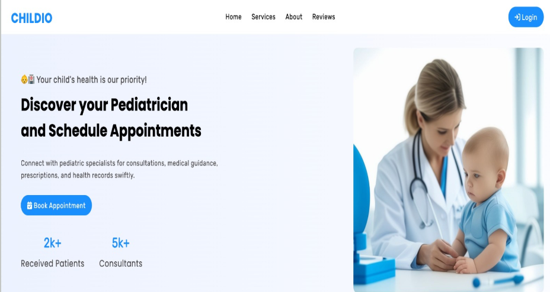

# Childo - Pediatric Clinic Management System

## Overview

The Pediatric Clinic Management System is a comprehensive web-based platform designed to streamline the operations of a pediatric clinic. This system incorporates advanced features for efficient data management, appointment scheduling, and patient care, ensuring an enhanced user experience for both staff and patients.

## Features

## Core Functionalities

- Interactive Landing Page: Welcomes users with an engaging and informative overview of the clinic.

- User Authentication and Authorization: Role-based access control for Admins, Doctors, Nurses, and Users.

- Appointment Scheduling System: Allows users to book appointments for their children with specific doctors based on real-time availability, with conflict validation.
- Data Management System: Secure storage and easy access to patient records, appointments, and progress notes.

- Interactive AI Chatbot: Tailored to assist users and staff with common inquiries and tasks.

- Light and Dark Modes: Enhances usability by providing visual options based on user preference.

## User-Centric Features

- Account Creation and Management: Users can create accounts, manage profiles, and add children’s details.

- Reservation Tracking: Users can view and manage their appointments with real-time updates.

- Progress Notes: Doctors can add detailed notes for patient follow-ups and therapy planning.

- Dashboard Access: Role-specific dashboards for easy navigation and functionality based on user roles.

## System Roles

### Admin

- Oversee all clinic operations.

- Manage user accounts and access permissions.

- Monitor system performance and resolve conflicts.

### User (Parent/Guardian)

- Create and manage personal accounts.

- Add and manage children’s details.

- Book and view appointments.

### Doctor

- Access patient records and scheduled appointments.

- Add progress notes and treatment details.

- Provide follow-up instructions for better therapy management.

### Nurse

View and manage patient information.

Assist doctors with patient follow-up and care.

## Benefits

- Enhanced operational efficiency.

- Improved patient care and satisfaction.

- Reduced administrative workload for staff.

- Increased data security and privacy.

- Optimized clinic resource management.

## Technology Stack

- Frontend: HTML, CSS, React, Vite

- Backend: .NET

- Database: SQL
